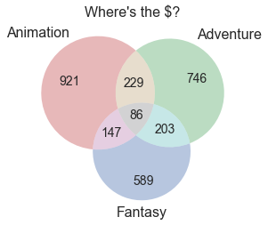

# Project 1 - Movie Industry

## Introduction 

Imagine Microsoft is interested in going into the industry of movie or online streaming or both, and creating original content. Without any previous exprience in making movies or video content, what can we do to prepare and arm Microsoft with good strategies, so that it can gradually chaim their shares from the movie market and make profits? 

One good approach is studying and gaining insights from historical movie data available from various datasources, including but not limited to, 'Box Office Mojo', 'IMDB', 'Rotten Tomatoes', and 'TheMovieDB.org'. This is also the approach laid out in this notebook.  

## Historical Data Used

Multiple datasets can be found in [Mod-1-Project-Instructions](https://github.com/learn-co-students/dc_ds_06_03_19/tree/master/module_1/week_3_project). There are three of them used in this notebook (data files can be found in `data` folder in the project repository ):
1.  "TheMovieDB.org" Dataset:
    1. data file: tmdb.movies.csv.gz
    2. [TMDB-data-source(year 2010-2018)](https://developers.themoviedb.org/3/discover/movie-discover)
2.  "The-Numbers.com" Dataset:
    1. data file: tn.movie_budgets.csv.gz
    2. [Numbers.com-data-source(include but not limit to year 2010-2018)](https://www.the-numbers.com/movie/budgets/all)
3.  "Box Office Mojo" Dataset:
    1. data file: bom.movie_gross.csv.gz
    2. [BoxOffice-data-source(year 2010-2018)](https://www.boxofficemojo.com/yearly/chart/?view2=worldwide&yr=2010&p=.htm)

## Key Findings & Suggestions

### Key Insights 

#### 1. Top Genres of Interest:

- Genres
    - 'Animation'
    - 'Adventure'
    - 'Fantasy'
    - 'Family'
    - 'Science Fiction'
    - 'Action'
- Characteristics of these top genres:
    - Most Profitable, in terms of average world-wide gross minus average production budget 
    - Performs much better internationally comparing to other genres
        - one insight: this may be due to these genres are less sensitive to culture difference than other genres such as drama and documentary. 
    - A significant portion of profit result from international sales 
    - Higher average production budget
    - Higher average number of reviews, except "Family" and "Animation"
        - one insight provided by others: customers of "Family" and "Animation" movies may have young age (e.g., < 10 years old), and they are unlikely to provide review on websites 
    - Less movies produced in these genres comparing to genres such as 'Drama','Comedy','Documentary',etc.

#### 2. Correlation among Profit, Production_budget, Review_count  
- Movies with higher budgets tend to be more profitble
- Movies with higher review_count (i.e., vote_count) tend to be more profitable 

#### 3. Risk of Loss in investing in the top Genres 
- Between 10-20% of movies within these genres see loss 

### Assumptions & Limitations
- Assumption: Business of focus right now is creating movies shown in movie theaters rather than online streaming
- Limitation: Data in these 3 datasets may not representative or not telling a whole picture, Hence, need to look into and compare with findings from other datasets available

### Sample Questions for Future Investigation
- What would be good studios to partner with (e.g., who are specialized in making good movies in certain genre)? 
- Marketing strategies
- More specificity of budget thresholds 
- Other Data Sources (IMDB, Rotten Tomatoes, social media analysis)

## Project Member & Responsibilities 
- Nateé Johnson
  - Data Merging, Data Cleaning
  - Data Analysis (Correlation Analysis, Plotting) 
- Tingting Li
  - Data Cleaning
  - Data Analysis (Plotting) 

## File Summary 
- Main Project Jupyter Notebook
  - Project1_Movie_Industry_Analysis.ipynb
- Data Merging & Exporting in `data_cleaning` folder
  - Project1_Part1_Data-Merge-Clean-Export-a.ipynb
  - Project1_Part1_Data-Merge-Clean-Export-b.ipynb
- New Dataset
  - tmdb_box_merge_new.csv (most recent version)
  - tmdb_box_merge.csv (older version in data_cleaning folder)
- Function file
  - movie_functions.py
